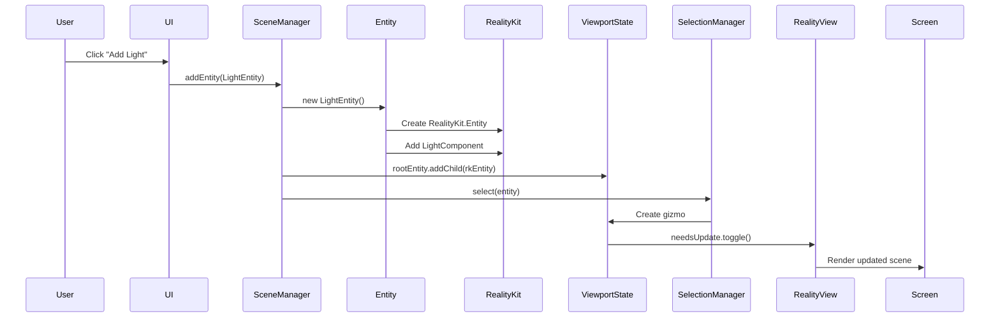
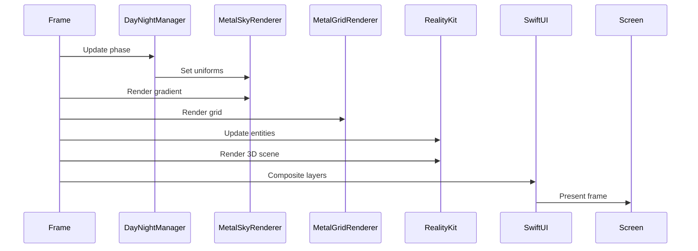
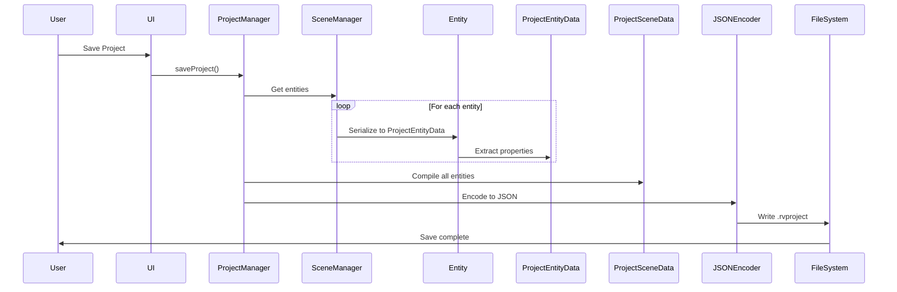

# RealityViewport Architecture

**Module**: ARCHITECTURE.md  
**Version**: 3.0  
**Architecture**: Entity/ECS + Metal Rendering + Adaptive UI  
**Philosophy**: Apple-native Unity DOTS alternative  
**Status**: Production Ready - ~70% Complete  
**Last Updated**: August 2025

## Architectural Overview

### Core Philosophy
**"What if Apple made Unity with DOTS?"**

This is an Apple-native 3D editor that embraces RealityKit's ECS foundation while providing a simplified Entity wrapper that will evolve over time. We combine the performance philosophy of Unity's Data-Oriented Technology Stack (DOTS) with Apple's native frameworks, creating a professional-grade viewport that can grow into a full game engine while staying 100% Apple native.

### Architecture Formula
```
Simplified Entity Wrappers + RealityKit ECS + Metal GPU Rendering + Adaptive UI = Apple-Native Unity Alternative
```

### Critical Architecture Evolution (v2.0 → v3.0)
```diff
- Node System (BaseSceneNode hierarchy)
+ Entity/ECS System (Simplified wrappers over RealityKit.Entity)

- CPU-based grid rendering
+ GPU Metal pipeline (Sky + Grid shaders)

- Platform-specific views (iPhoneView, MacView)
+ Single adaptive ContentView (WWDC25 standard)

- Complex entity system on day 1
+ Simplified Entity wrapper that grows with needs
```

## 📚 Document Reading Guide

### For Different Purposes

#### 🎯 "I want to understand the system"
1. **Architecture.md** - Design philosophy and patterns
2. **EntitySystem.md** - Core Entity wrapper system
3. **MetalRendering.md** - GPU rendering pipeline
4. **Implementation.md** - Current state

#### 🐛 "I need to fix a bug"
1. **Implementation.md** - Known issues and status
2. **session.json** - Runtime state
3. **EntitySystem.md** or **MetalRendering.md** - Depending on bug type
4. Check component's specific status in relevant manager

#### 🚀 "I want to add a feature"
1. **Architecture.md** - Patterns to follow
2. **EntitySystem.md** - How to extend entities
3. **Visual.md** - UI integration patterns
4. **Navigation.md** - User flow integration

#### 📁 "I'm working with files"
1. **FileOperations.md** - Serialization patterns
2. **Navigation.md** - Import/export flows
3. **EntitySystem.md** - Entity data structures

## System Architecture Layers

```
┌─────────────────────────────────────────────┐
│            Application Layer                 │
│         RealityViewportApp.swift            │
├─────────────────────────────────────────────┤
│            UI Layer (SwiftUI)               │
│    ContentView (Adaptive) + Inspector       │
├─────────────────────────────────────────────┤
│     Simplified Entity Layer (Growing)       │
│   Entity, CameraEntity, LightEntity, etc.   │
│          (Wrappers over RealityKit)         │
├─────────────────────────────────────────────┤
│        RealityKit ECS (Foundation)          │
│    Full Apple Entity Component System       │
├─────────────────────────────────────────────┤
│           Manager Layer                     │
│  Scene, Selection, Project, Control, DayNight│
├─────────────────────────────────────────────┤
│         Rendering Layer (Hybrid)            │
│    Metal (Sky/Grid) + RealityKit (3D)       │
├─────────────────────────────────────────────┤
│          Platform Layer                     │
│      iOS / macOS / tvOS Abstractions        │
└─────────────────────────────────────────────┘
```

## Standard Code Patterns

### Entity Disambiguation Pattern
```swift
// ALWAYS use this pattern to clarify Entity types:

// Your simplified Entity wrapper (will evolve over time)
import RealityViewport
let customEntity = Entity()              // Your Entity class
customEntity.position = SIMD3<Float>()   // Simplified API

// Apple's full-featured Entity
import RealityKit
let rkEntity = RealityKit.Entity()       // Apple's Entity
rkEntity.components[Transform.self]      // Full ECS access

// Bridge between systems
let wrapped = customEntity.realityEntity // Returns RealityKit.Entity

// ViewportState always uses RealityKit.Entity directly
viewportState.rootEntity                 // RealityKit.Entity type
```

### Performance Baseline
```swift
// Standard performance metrics (60fps = 16.67ms budget)
let performanceTargets = """
  Sky Rendering: 0.5ms
  Grid Rendering: 0.3ms  
  Entity Updates: 1-2ms
  RealityKit Scene: 8-12ms
  SwiftUI Composition: 2ms
  Total: 11-15ms (leaving 1-5ms headroom)
"""
```

### Manager Access Pattern
```swift
// Consistent manager access throughout app
@EnvironmentObject var sceneManager: SceneManager
@EnvironmentObject var projectManager: ProjectManager
@StateObject private var selectionManager = sceneManager.selectionManager
```

## Core Design Patterns

### Pattern 1: Simplified Entity Wrapper System
```swift
PURPOSE: Start simple, grow with needs
PHILOSOPHY: 
  - Day 1: Basic position/rotation/scale wrapper
  - Over time: Add features as game requires them
  - End goal: Potentially full parity with RealityKit.Entity
IMPLEMENTATION: 
  - Entity class wraps RealityKit.Entity
  - Exposes simplified, Unity-like API
  - Direct access to underlying RealityKit.Entity when needed
BENEFITS:
  - Ship alpha quickly with working basics
  - No unnecessary complexity upfront
  - Can access full RealityKit power when needed
  - API evolves based on real requirements
```

### Pattern 2: Metal + RealityKit Rendering Composition
```swift
PURPOSE: GPU-accelerated backgrounds with 3D content
IMPLEMENTATION:
  - Metal renders sky gradient (day/night cycle)
  - Metal renders reference grid with distance fade
  - RealityKit renders 3D entities and models
  - Transparent layer composition in SwiftUI
BENEFITS:
  - 60fps consistent performance
  - Dynamic atmospheric effects
  - Minimal CPU overhead
  - Professional visual quality
```

### Pattern 3: ViewportState with Native RealityKit.Entity
```swift
PURPOSE: Clean separation between wrapper and native systems
IMPLEMENTATION:
  - ViewportState uses RealityKit.Entity directly
  - No custom Entity wrapper pollution in viewport
  - SceneManager bridges between wrapper and native
BENEFITS:
  - No type confusion
  - Direct RealityKit performance
  - Clear architectural boundaries
  - Easy to reason about
```

### Pattern 4: Manager-Driven Architecture
```swift
PURPOSE: Domain-specific responsibility separation
MANAGERS:
  - SceneManager: Entity lifecycle and scene graph
  - SelectionManager: Multi-selection with gizmos
  - ProjectManager: Persistence and file I/O
  - ControlManager: Input handling
  - DayNightManager: Atmospheric lighting
BENEFITS:
  - Single responsibility principle
  - Easy testing and debugging
  - Clear data flow
  - Modular enhancement
```

### Pattern 5: Protocol-Based Entity System
```swift
PURPOSE: Flexible entity types with common interface
IMPLEMENTATION:
  protocol SceneEntity {
    var id: UUID { get }
    var position: SIMD3<Float> { get set }
    var realityEntity: RealityKit.Entity { get }
  }
BENEFITS:
  - Polymorphic entity handling
  - Type-safe collections
  - Protocol extensions for shared behavior
  - Easy to add new entity types
```

### Pattern 6: Adaptive UI (WWDC25 Standard)
```swift
PURPOSE: Single view hierarchy for all platforms
IMPLEMENTATION:
  - NavigationSplitView for regular sizes (iPad/Mac)
  - NavigationStack for compact sizes (iPhone)
  - Platform-specific modifiers only when essential
BENEFITS:
  - 95% code reuse across platforms
  - Automatic adaptation to new devices
  - Consistent user experience
  - Reduced maintenance burden
```

## Glossary

### Core Terms

**Entity (Custom)**: Your simplified wrapper class around RealityKit.Entity, providing a Unity-like API. Will evolve toward full feature parity with Apple's Entity over time.

**RealityKit.Entity**: Apple's native Entity class with full ECS capabilities. Your custom Entity wraps this for ease of use.

**ECS (Entity Component System)**: A game architecture pattern where:
- Entities are containers with unique IDs
- Components are pure data
- Systems process entities with specific components

**DOTS (Data-Oriented Technology Stack)**: Unity's modern architecture focusing on cache-efficient data layout and parallel processing. Your system is "what if Apple made DOTS."

**Metal Rendering Pipeline**: GPU-accelerated rendering using Apple's Metal API for sky and grid, composited with RealityKit.

**Adaptive UI**: Single SwiftUI view hierarchy that automatically adjusts layout based on size class (WWDC'25 best practice).

**SceneEntity Protocol**: Your interface that all entity types must conform to, providing polymorphic behavior.

**ViewportState**: The single source of truth for viewport rendering, managing RealityKit.Entity instances directly.

**Billboard Component**: A component that makes an entity always face the camera (useful for UI elements in 3D space).

**Gizmo**: 3D manipulation widget for transforming selected entities (move, rotate, scale).

### Architecture Philosophy

This is an **Apple-native Unity DOTS alternative** that:
- Uses RealityKit's ECS as the foundation
- Adds a simplified Entity wrapper that will grow over time
- Combines Metal + RealityKit for optimal performance
- Follows Apple's design patterns and best practices
- Aims to be "what Unity would be if Apple built it"

## Component Architecture

```
RealityViewportApp
├── Managers (EnvironmentObject)
│   ├── SceneManager (Entity lifecycle)
│   ├── ProjectManager (Persistence)
│   ├── SelectionManager (via SceneManager)
│   └── DayNightManager (Atmospheric effects)
│
├── ContentView (Adaptive)
│   ├── ViewportStack
│   │   ├── MetalSkyView (Layer 0: GPU sky gradient)
│   │   ├── ViewportMetalGrid (Layer 1: GPU grid)
│   │   └── ViewportView (Layer 2: RealityKit content)
│   │       ├── RealityView (3D entities)
│   │       ├── ViewportToolbar
│   │       └── CameraController
│   │
│   └── Inspector (Adaptive)
│       ├── OutlinerView (Entity hierarchy)
│       └── PropertiesView (Entity properties)
│
└── Sheets/Modals
    ├── ProjectBrowserView
    ├── Import Dialog
    └── Export Options
```

## Entity System Architecture

### Entity Wrapper Evolution
```
Current (v3.0) - Simplified Wrapper:
├── Basic transforms (position, rotation, scale)
├── Observable properties for SwiftUI
├── Direct RealityKit.Entity access
└── Type-specific features (Camera, Light, Model)

Future Growth Path:
├── Animation support (as needed)
├── Physics integration (when required)
├── Advanced components (on demand)
└── Full ECS access (already available via .realityEntity)
```

### Entity Hierarchy
```
SceneEntity (Protocol)
    │
    ├── Entity (Base Wrapper Class)
    │   ├── realityEntity: RealityKit.Entity  // Bridge to full ECS
    │   ├── position: SIMD3<Float>           // Simplified access
    │   ├── rotation: simd_quatf             // Unity-like API
    │   └── scale: SIMD3<Float>              // Observable
    │
    ├── CameraEntity : Entity
    │   ├── fov: Float
    │   └── nearPlane/farPlane: Float
    │
    ├── LightEntity : Entity
    │   ├── lightType: LightType
    │   ├── intensity: Float
    │   └── color: SIMD3<Float>
    │
    └── ModelEntity : Entity
        ├── modelURL: URL?
        └── isLoading: Bool
```

### Component Access Patterns
```swift
// Simplified API (your wrapper)
entity.position = SIMD3<Float>(1, 2, 3)
entity.name = "Player"

// Full ECS access (when needed)
entity.realityEntity.components.set(ModelComponent(...))
entity.realityEntity.components[CollisionComponent.self]

// Custom components (growing library)
EntitySelectionComponent  // For selection system
BillboardComponent        // Always face camera
TransformGizmoComponent   // Visual manipulation
```

## Key System Flows

### Entity Creation Flow


### Render Pipeline Flow


### File Save Flow with Entity Serialization


## State Management Architecture

### State Flow
```
User Input → Manager → @Published Property → SwiftUI View → RealityKit/Metal
```

### Key State Containers
```swift
// Scene State (manages custom Entity wrappers)
SceneManager {
    @Published var entities: [any SceneEntity]
    @Published var selectedEntity: (any SceneEntity)?
    var realityEntities: [UUID: RealityKit.Entity]  // Bridge mapping
}

// Viewport State (uses RealityKit.Entity directly)
ViewportState {
    let rootEntity: RealityKit.Entity              // Native type
    let cameraEntity: PerspectiveCamera            // RealityKit subclass
    var lightEntities: [UUID: RealityKit.Entity]   // Native tracking
    @Published var needsUpdate: Bool
}

// Project State
ProjectManager {
    @Published var currentProject: ProjectFile?
    @Published var recentProjects: [ProjectFile]
}
```

## Rendering Pipeline Architecture

### Layer Composition (Back to Front)
```
Layer 0: Metal Sky Renderer
   - Full-screen gradient
   - Day/night cycle (4 phases)
   - GPU shader-based
   - 0.5ms render time

Layer 1: Metal Grid Renderer  
   - Ground plane grid
   - Distance-based fade
   - Colored axes (R/G/B)
   - 0.3ms render time

Layer 2: RealityKit Scene
   - 3D entities (models)
   - Gizmos (transform handles)
   - Billboard icons
   - 8-12ms render time

Composition: Transparent overlay with Color.clear backgrounds
Total: 11-15ms @ 60fps (1-5ms headroom)
```

## Platform Abstraction Layer

### Cross-Platform Types
```swift
// Unified color type
#if os(macOS)
    typealias PlatformColor = NSColor
#else
    typealias PlatformColor = UIColor
#endif

// Unified image type
#if os(macOS)
    typealias PlatformImage = NSImage
#else
    typealias PlatformImage = UIImage
#endif
```

### Adaptive Features
```swift
// Size class detection
@Environment(\.horizontalSizeClass) var sizeClass

// Platform-specific only when essential
#if os(iOS)
    .onTapGesture { }  // Touch
#elseif os(macOS)
    .onHover { }        // Mouse
#endif
```

## Anti-Patterns to Avoid

### ❌ NEVER: Confuse Entity Types
```swift
// WRONG - Type mismatch
let entity = Entity()
viewportState.rootEntity = entity  // Error: expects RealityKit.Entity

// CORRECT - Use bridge
let entity = Entity()
viewportState.rootEntity.addChild(entity.realityEntity)
```

### ❌ NEVER: Over-Engineer Early
```swift
// WRONG - Building everything day 1
class Entity {
    // 100 properties and methods before shipping...
}

// CORRECT - Start simple, grow with needs
class Entity {
    // Just what's needed for alpha
    var position: SIMD3<Float>
    var realityEntity: RealityKit.Entity  // Escape hatch
}
```

### ❌ NEVER: Platform-Specific Views
```swift
// WRONG - Maintaining multiple views
#if os(iOS)
    iPhoneView()
#else
    MacView()
#endif

// CORRECT - Single adaptive view
ContentView()  // Adapts automatically
```

## Architectural Decisions Log

### Decision: Simplified Entity Wrappers
**Rationale**: Can't build Rome in a day - start simple, grow with needs  
**Implementation**: Basic Entity wrapper exposing core features  
**Result**: Shipping alpha quickly while keeping door open for growth

### Decision: "Apple-Native Unity DOTS"
**Rationale**: Best of both worlds - Unity patterns with Apple performance  
**Implementation**: RealityKit ECS foundation with familiar API on top  
**Result**: Familiar for Unity devs, native performance

### Decision: Metal Rendering Pipeline
**Rationale**: GPU acceleration essential for 60fps  
**Implementation**: Metal shaders for sky/grid, RealityKit for 3D  
**Result**: Smooth performance with atmospheric effects

### Decision: Single Adaptive View
**Rationale**: WWDC25 best practices, maintainability  
**Implementation**: NavigationSplitView/Stack with size classes  
**Result**: 95% code reuse across platforms

## Performance Considerations

### Current Performance Profile
```yaml
Frame Budget: 16.67ms (60fps)
Current Usage: 11-15ms
Headroom: 1-5ms

Breakdown:
  Sky Rendering: 0.5ms (Metal GPU)
  Grid Rendering: 0.3ms (Metal GPU)
  Entity Updates: 1-2ms (CPU)
  RealityKit Scene: 8-12ms (GPU + CPU)
  SwiftUI: 2ms (CPU)
```

### Optimization Strategies
- Batch entity updates when possible
- Frustum culling for off-screen entities
- LOD system (future)
- Entity pooling (future)
- Texture atlasing (future)

## Future Architecture Enhancements

### Near Term (Growing the Entity System)
- [ ] Animation support (when needed)
- [ ] Physics integration (when required)
- [ ] Particle system wrapper (on demand)
- [ ] Audio components (as game requires)

### Medium Term (System Enhancements)
- [ ] Entity pooling for performance
- [ ] Undo/Redo system
- [ ] Plugin architecture
- [ ] Multi-window support (macOS)

### Long Term (Engine Evolution)
- [ ] Full ECS wrapper parity
- [ ] Compute shaders for effects
- [ ] Networking/multiplayer
- [ ] Cloud project sync

## See Also
- **EntitySystem.md** - Detailed Entity wrapper implementation
- **MetalRendering.md** - GPU rendering pipeline details
- **ViewportState.md** - Viewport state management
- **Implementation.md** - Current implementation status

## Architecture Summary

The v3.0 architecture represents an **Apple-native Unity DOTS alternative**:
- **Simplified Entity wrappers** that grow with your needs
- **RealityKit ECS foundation** for native performance
- **Metal GPU rendering** for atmospheric effects
- **Adaptive UI** following Apple's latest standards
- **60fps performance** across all Apple platforms

This architecture provides the perfect balance: ship quickly with a simple wrapper while maintaining access to RealityKit's full power when needed. It's not about building everything on day 1 - it's about building the right foundation that can evolve into whatever your game needs.