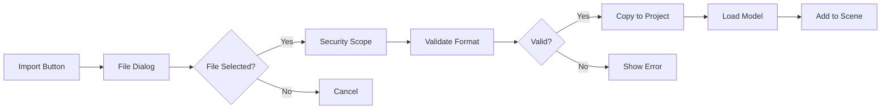

# RealityViewport File Operations Documentation

**Purpose**: Document complete file system integration  
**Version**: 1.0  
**Status**: 85% Complete - Fully Functional  
**Last Updated**: July 2025

## Overview

RealityViewport implements a sophisticated file system integration using SwiftUI's native file dialogs, security-scoped resources, and a custom .rvproject format. The system is cross-platform with platform-specific optimizations.

## Project File Format

### .rvproject Structure
```
ProjectName.rvproject/
├── manifest.json          # Project metadata
├── scene.json            # Scene graph serialization
├── assets/               # Imported model files
│   ├── model1.usdz
│   └── model2.reality
├── thumbnails/           # Preview images
│   └── preview.png
└── settings.json         # Project-specific settings
```

### Manifest Format
```json
{
  "version": "1.0",
  "name": "My Project",
  "created": "2025-07-29T10:00:00Z",
  "modified": "2025-07-29T15:30:00Z",
  "thumbnail": "thumbnails/preview.png",
  "sceneFile": "scene.json",
  "settings": "settings.json"
}
```

## File Dialog Implementation

### Core Components
```swift
// FileDialogs.swift provides cross-platform file operations
struct FileDialogs {
    static func showNewProjectDialog() async -> ProjectDocument?
    static func showSaveDialog(for project: ProjectDocument) async -> URL?
    static func showOpenDialog() async -> ProjectDocument?
    static func showImportDialog() async -> [URL]?
    static func showExportDialog() async -> (URL, ExportFormat)?
}
```

### Platform-Specific Handling
```swift
#if os(macOS)
    // Native macOS file dialogs with full features
    .fileImporter(
        isPresented: $showImporter,
        allowedContentTypes: [.usdz, .realityFile],
        allowsMultipleSelection: true
    )
#else
    // iOS/tvOS document browser
    .fileImporter(
        isPresented: $showImporter,
        allowedContentTypes: [.usdz, .realityFile]
    )
#endif
```

## Security-Scoped Resource Management

### Access Pattern
```swift
func loadModel(from url: URL) async throws -> ModelEntity {
    // Start security scope
    let accessing = url.startAccessingSecurityScopedResource()
    defer {
        if accessing {
            url.stopAccessingSecurityScopedResource()
        }
    }
    
    // Load within scope
    return try await ModelEntity.loadModelAsync(contentsOf: url)
}
```

### Bookmark Storage
```swift
// Store bookmarks for persistent access
func storeBookmark(for url: URL) throws -> Data {
    try url.bookmarkData(
        options: .withSecurityScope,
        includingResourceValuesForKeys: nil,
        relativeTo: nil
    )
}

// Restore from bookmark
func restoreURL(from bookmark: Data) throws -> URL {
    var isStale = false
    return try URL(
        resolvingBookmarkData: bookmark,
        options: .withSecurityScope,
        relativeTo: nil,
        bookmarkDataIsStale: &isStale
    )
}
```

## Import/Export Workflows

### Import Workflow


### Supported Import Formats
```swift
static let supportedImportTypes: [UTType] = [
    .usdz,           // Universal Scene Description
    .realityFile,    // Reality Composer scenes
    .threeDContent   // Generic 3D content
]
```

### Export Workflow
```swift
enum ExportFormat: String, CaseIterable {
    case usdz = "USDZ"
    case reality = "Reality"
    case json = "JSON"
    
    var fileExtension: String {
        switch self {
        case .usdz: return "usdz"
        case .reality: return "reality"
        case .json: return "json"
        }
    }
}
```

## Error Handling Patterns

### File Operation Errors
```swift
enum FileOperationError: LocalizedError {
    case accessDenied
    case invalidFormat
    case corruptedFile
    case diskFull
    case securityScopeFailed
    
    var errorDescription: String? {
        switch self {
        case .accessDenied:
            return "Cannot access file. Please grant permission."
        case .invalidFormat:
            return "File format not supported."
        case .corruptedFile:
            return "File appears to be corrupted."
        case .diskFull:
            return "Not enough disk space."
        case .securityScopeFailed:
            return "Failed to access sandboxed resource."
        }
    }
}
```

### Error Recovery
```swift
func importModelWithRecovery(from url: URL) async {
    do {
        let model = try await loadModel(from: url)
        sceneManager.addNode(model)
    } catch FileOperationError.invalidFormat {
        // Show format error dialog
        showErrorAlert("Unsupported format", "Try USDZ or Reality files")
    } catch FileOperationError.securityScopeFailed {
        // Request permission again
        await requestFileAccess(for: url)
    } catch {
        // Generic error with details
        showErrorAlert("Import Failed", error.localizedDescription)
    }
}
```

## Project Document Implementation

### ProjectDocument Structure
```swift
struct ProjectDocument: Codable {
    let id: UUID
    var name: String
    var created: Date
    var modified: Date
    var sceneData: SceneData
    var assetReferences: [AssetReference]
    var settings: ProjectSettings
}

struct AssetReference: Codable {
    let id: UUID
    let filename: String
    let bookmark: Data  // Security-scoped bookmark
    let checksum: String
}
```

### Save Operation
```swift
func saveProject(_ project: ProjectDocument, to url: URL) async throws {
    // Create project directory
    try FileManager.default.createDirectory(
        at: url,
        withIntermediateDirectories: true
    )
    
    // Save manifest
    let manifestURL = url.appendingPathComponent("manifest.json")
    let encoder = JSONEncoder()
    encoder.outputFormatting = [.prettyPrinted, .sortedKeys]
    let manifestData = try encoder.encode(project)
    try manifestData.write(to: manifestURL)
    
    // Copy referenced assets
    for asset in project.assetReferences {
        try await copyAsset(asset, to: url.appendingPathComponent("assets"))
    }
}
```

### Load Operation
```swift
func loadProject(from url: URL) async throws -> ProjectDocument {
    // Access security scope
    let accessing = url.startAccessingSecurityScopedResource()
    defer {
        if accessing {
            url.stopAccessingSecurityScopedResource()
        }
    }
    
    // Load manifest
    let manifestURL = url.appendingPathComponent("manifest.json")
    let manifestData = try Data(contentsOf: manifestURL)
    let decoder = JSONDecoder()
    var project = try decoder.decode(ProjectDocument.self, from: manifestData)
    
    // Restore asset references
    for i in 0..<project.assetReferences.count {
        let assetURL = url.appendingPathComponent("assets")
            .appendingPathComponent(project.assetReferences[i].filename)
        let bookmark = try assetURL.bookmarkData(
            options: .withSecurityScope
        )
        project.assetReferences[i].bookmark = bookmark
    }
    
    return project
}
```

## Cross-Platform Considerations

### macOS
- Full NSSavePanel/NSOpenPanel features
- Multiple file selection
- Directory access
- Custom accessory views

### iOS
- Document browser integration
- Files app support
- iCloud Drive access
- Share sheet export

### tvOS
- Limited file access
- Network share support
- iCloud Drive only
- Simplified UI

## Best Practices

### DO: Always Use Security Scopes
```swift
// Correct: Proper scope management
let accessing = url.startAccessingSecurityScopedResource()
defer { if accessing { url.stopAccessingSecurityScopedResource() } }
// ... work with file ...
```

### DON'T: Assume File Access
```swift
// Wrong: May fail in sandbox
let data = try Data(contentsOf: url)
```

### DO: Handle Errors Gracefully
```swift
// Correct: User-friendly error handling
do {
    try await saveProject(project)
    showSuccessMessage("Project saved successfully")
} catch {
    showErrorAlert("Save failed", error.localizedDescription)
}
```

### DO: Validate File Formats
```swift
// Correct: Check before processing
guard url.pathExtension == "usdz" || url.pathExtension == "reality" else {
    throw FileOperationError.invalidFormat
}
```

## Performance Optimizations

- **Async Loading**: All file operations are async
- **Progress Reporting**: Long operations show progress
- **Chunked Copying**: Large files copied in chunks
- **Lazy Asset Loading**: Load assets only when needed

## Future Enhancements

- [ ] Cloud sync support (iCloud/CloudKit)
- [ ] Project versioning
- [ ] Incremental saves
- [ ] Asset compression
- [ ] Network collaboration
- [ ] Auto-save with intervals
- [ ] Project templates